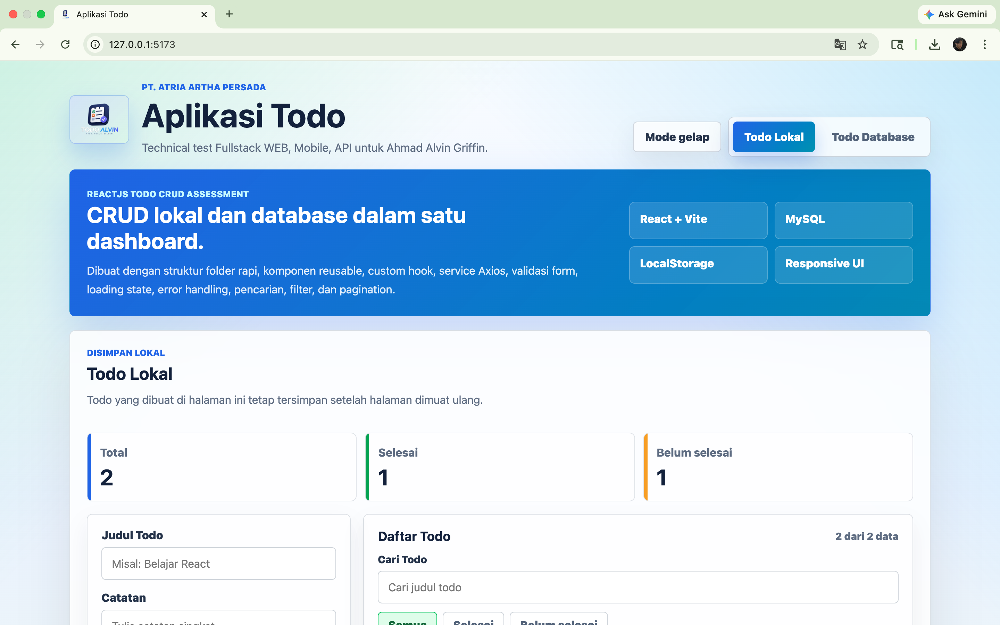
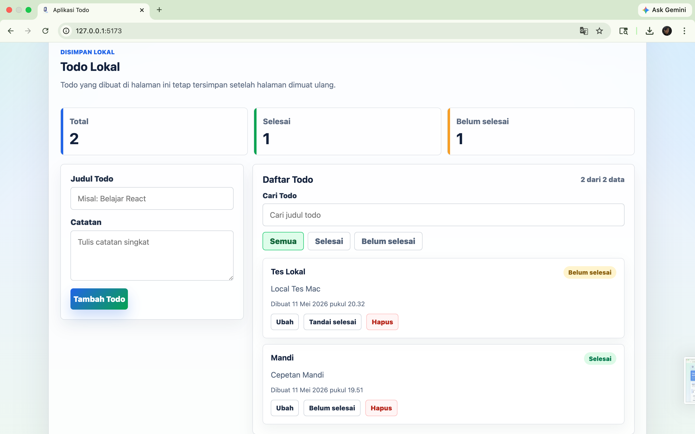
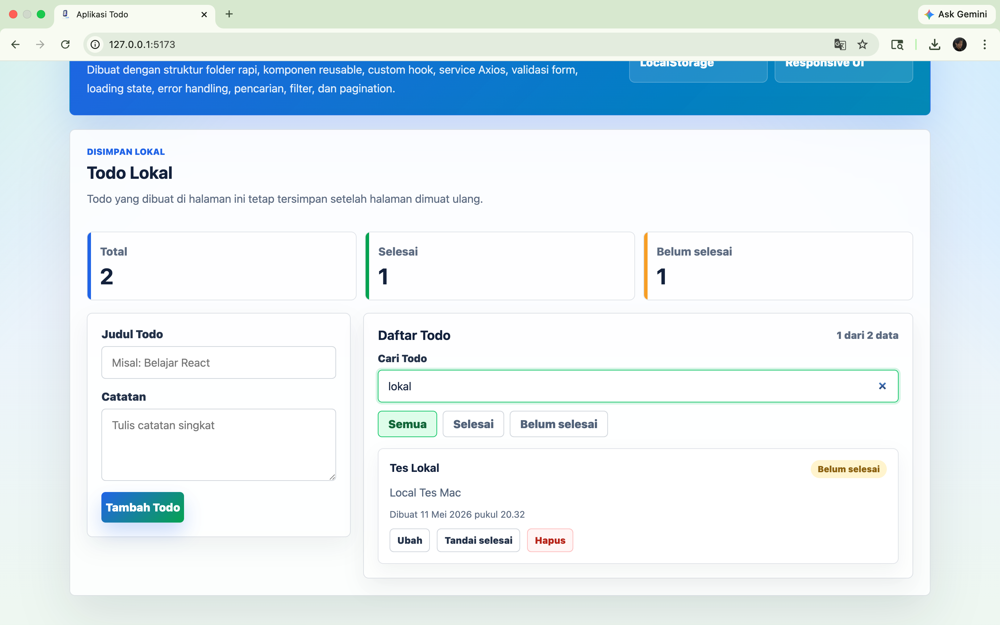
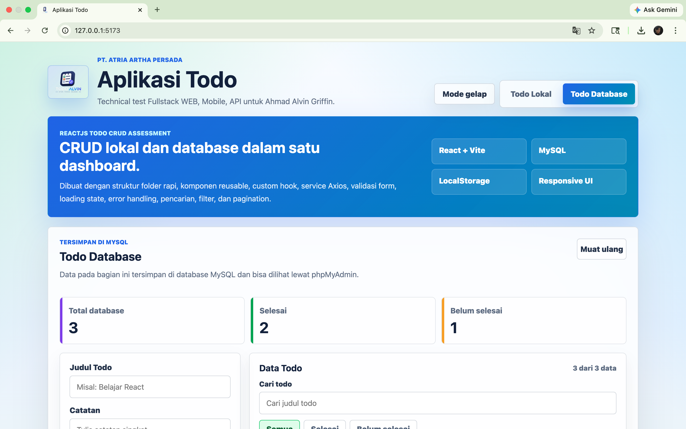
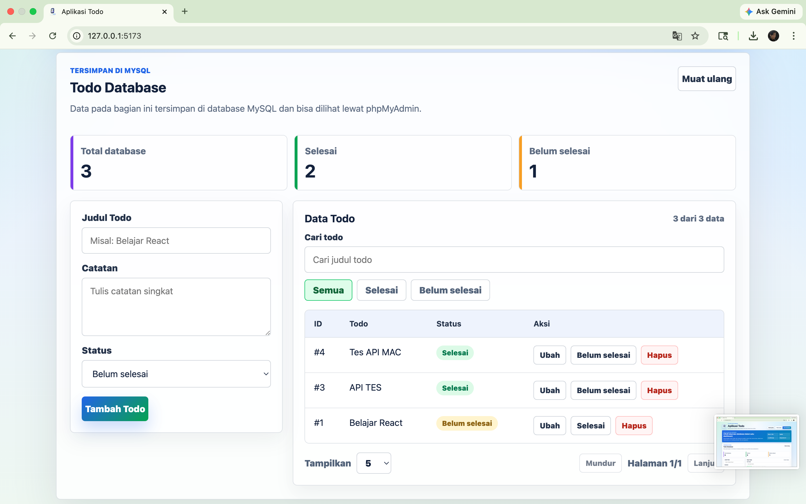
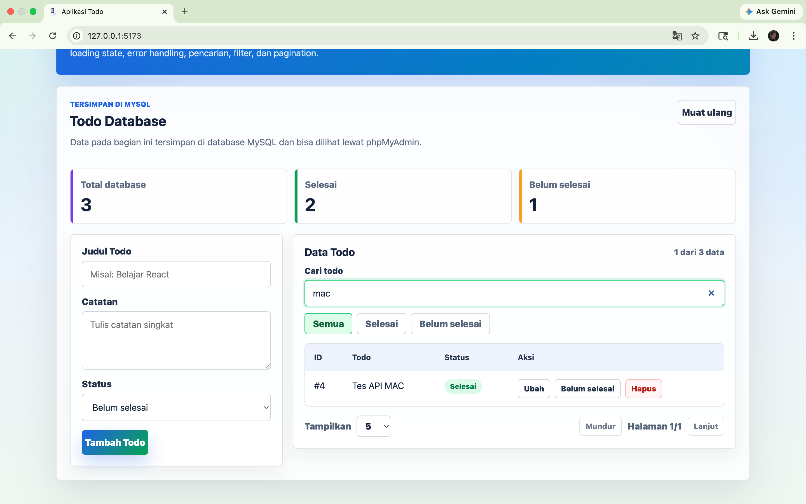
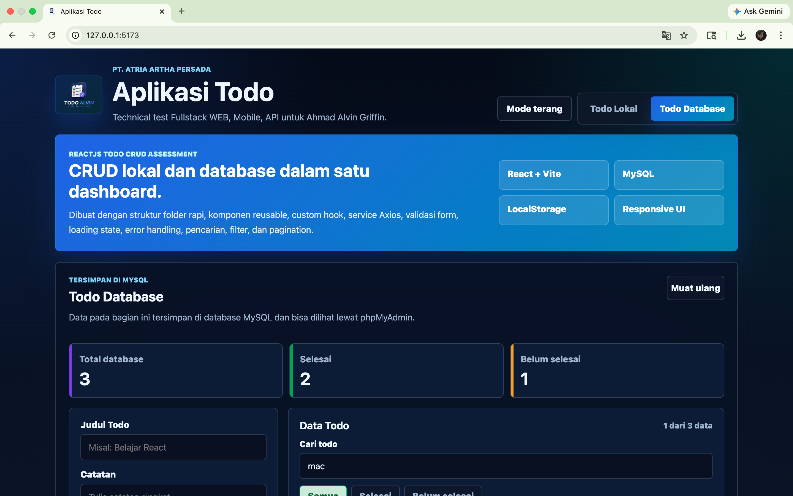
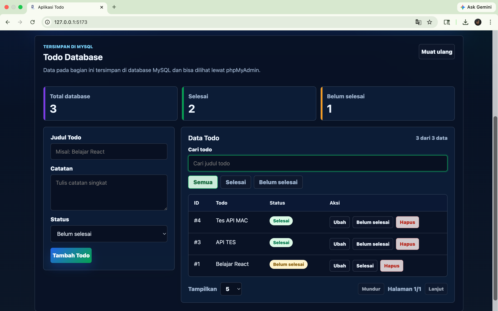
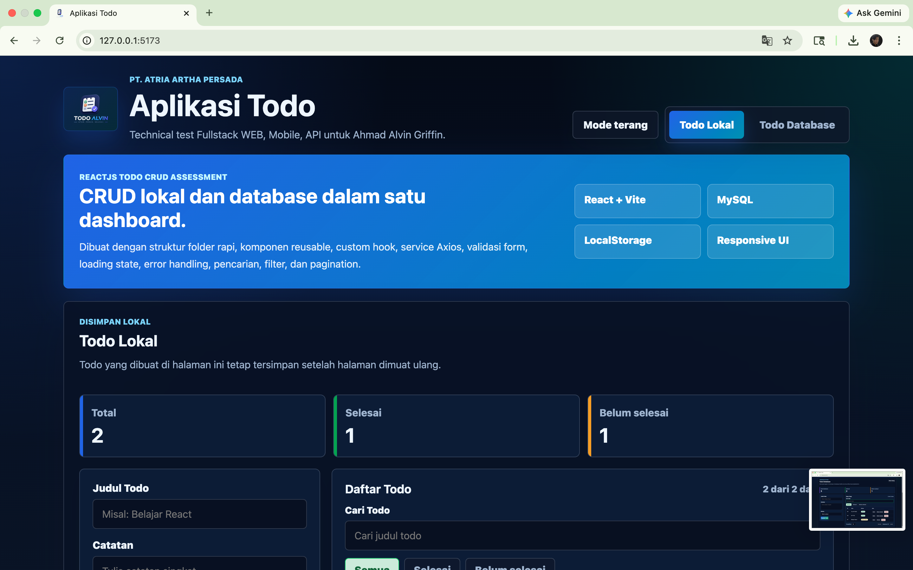
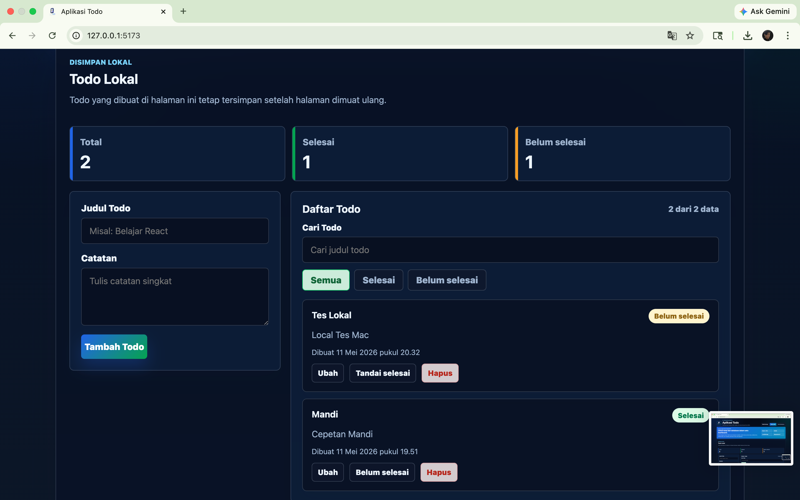

# Todo Alvin

Todo Alvin adalah aplikasi Flutter untuk mengelola todo lokal dan todo dari API dummy. Aplikasi dibuat untuk technical test Fullstack Frontend Developer dengan fokus pada UI Android yang clean, penyimpanan lokal, integrasi API, dan struktur kode yang rapi.

## Fitur Aplikasi

- Todo Lokal dengan tambah, tampil, edit, ubah status, hapus, search, dan filter.
- Persist data lokal memakai SharedPreferences.
- Todo API memakai DummyJSON dengan fetch, create, update, delete, loading, error handling, refresh, dan pagination.
- UI Bahasa Indonesia.
- Light mode dan dark mode mengikuti sistem perangkat.
- Reusable widget untuk form, card, header, dan empty state.
- Unit test dasar untuk model Todo.

## Teknologi

- Flutter
- Dart
- SharedPreferences
- HTTP package
- DummyJSON Todos API

## Struktur Folder

```text
lib/
  core/
    constants/
    theme/
    utils/
  data/
    models/
    services/
    repositories/
  presentation/
    pages/
    widgets/
    controllers/
```

## Cara Install

```bash
flutter pub get
```

## Cara Run di Android

Pastikan emulator atau perangkat Android sudah aktif, lalu jalankan:

```bash
flutter run
```

## Architecture

Project memakai pemisahan sederhana:

- `core` berisi konstanta, theme, dan utility umum.
- `data` berisi model, DTO, service, dan repository.
- `presentation` berisi halaman, widget, dan controller.

UI tidak memanggil API atau SharedPreferences secara langsung. Halaman memakai controller, controller memakai repository, lalu repository memakai service. Mapping data API dipisahkan melalui DTO agar model aplikasi tetap konsisten.

## API yang Digunakan

Aplikasi memakai DummyJSON Todos API:

```text
https://dummyjson.com/todos
```

Endpoint yang digunakan:

- `GET /todos?limit=10&skip=0`
- `POST /todos/add`
- `PUT /todos/{id}`
- `DELETE /todos/{id}`

## Catatan Penyimpanan Lokal

Todo Lokal disimpan di perangkat memakai SharedPreferences dalam bentuk list JSON string. Data tidak hilang ketika aplikasi ditutup selama storage aplikasi tidak dihapus.

## Catatan API Dummy

DummyJSON tidak menyimpan perubahan secara permanen. Karena itu, setelah create, update, atau delete berhasil mendapat response dari API, aplikasi memperbarui state lokal di layar agar pengguna tetap melihat hasil aksinya.

## Screenshot

| Todo Lokal | Todo API |
| --- | --- |
|  |  |
|  |  |
|  |  |
|  |  |
|  |  |
